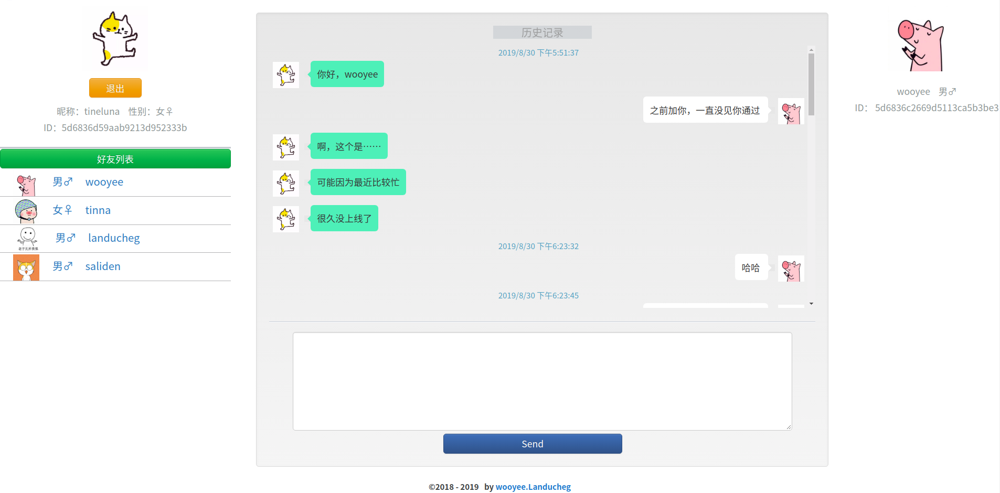
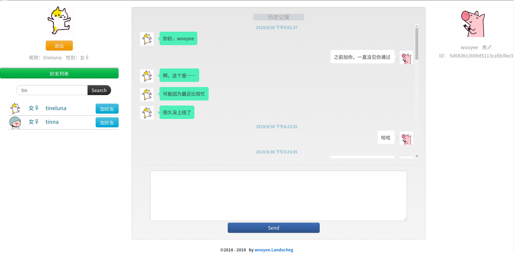
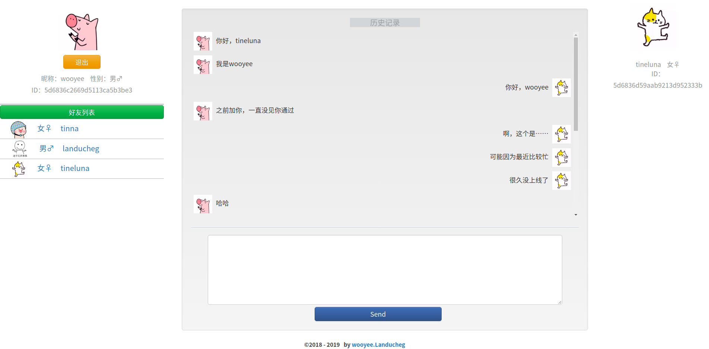

# chat IM
## 一个基于nodejs的聊天室（IM）...
* nodejs
* express
* socket.io
* mongodb
* ejs
* bootstrap
* jquery
* ajax
---
### ①登录页面：

---
### ②登录失败：

---
### ③登录成功：

---
### ④搜索好友：

---
### ⑤获取聊天记录：

---
>> #### 聊天新消息持久化缓存，新消息提示等基本功能~
> ***该项目没有设置注册功能，但是有好友搜索和添加功能..***
### 因为没有注册功能，所以这里提供几个测试账号：【在使用账号前需要通过运行项目中的saveUser.js文件来添加用户到mongodb数据库，你也可以在添加前应该进入文件修改添加用户的基本信息，saveUser.js文件的内容均被注释】
* 13509270762 ps:wooyee
* 13703207624 ps:tinna
* 13794340183 ps:tineluna
* 15306212701 ps:landucheg
